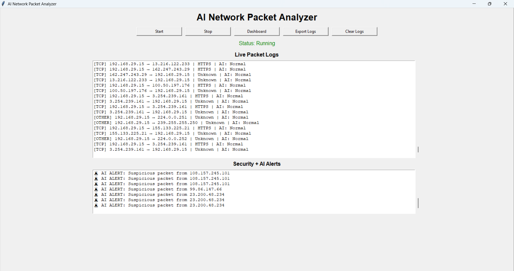
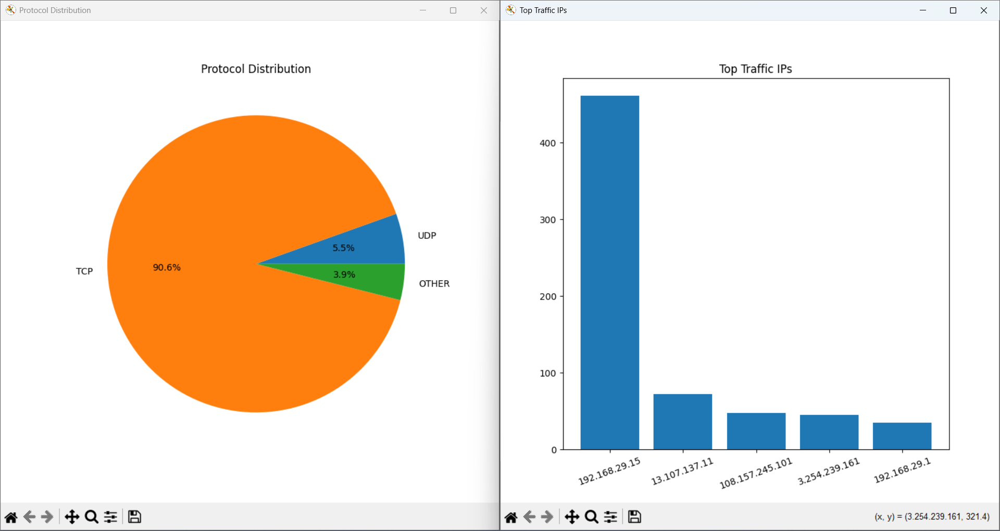
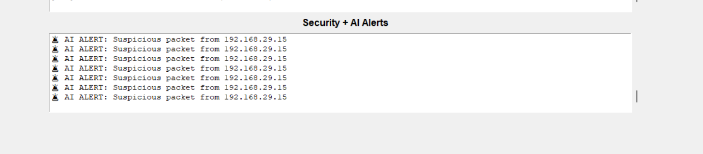

# AI-Powered Network Packet Analyzer

An advanced cybersecurity and AI-powered desktop application for live packet sniffing, anomaly detection, protocol analysis, and traffic analytics.

---

## Features

✅ Live packet sniffing

✅ Protocol detection:
- TCP
- UDP
- ICMP

✅ Application protocol detection:
- HTTP
- HTTPS
- DNS

✅ AI anomaly detection using Isolation Forest

✅ Suspicious packet alerts

✅ High traffic monitoring

✅ Real-time desktop GUI

✅ Traffic analytics dashboard

✅ Export logs to CSV

---

## Project Architecture

```text
GUI (Tkinter)
    │
    ├── Packet Sniffer (Scapy)
    │
    ├── AI Detector
    │      └── Isolation Forest
    │
    ├── Dashboard Analytics
    │      ├── Protocol Distribution
    │      └── Top Traffic IPs
    │
    └── CSV Log Export
```

---

## Tech Stack

- Python
- Scapy
- Tkinter
- Pandas
- Matplotlib
- Scikit-Learn
- Isolation Forest (AI)

---

## Folder Structure

```text
AI_Network_Packet_Analyzer/
│── main.py
│── gui.py
│── packet_sniffer.py
│── ai_detector.py
│── dashboard.py
│── requirements.txt
│── README.md
│── .gitignore
│
├── exports/
│
├── screenshots/
│   ├── main_gui.png
│   ├── dashboard.png
│   └── ai_alerts.png
```

---

## Installation

Clone repository:

```bash
git clone YOUR_GITHUB_LINK
```

Install dependencies:

```bash
pip install -r requirements.txt
```

Run project:

```bash
python main.py
```

---

## Screenshots

### Main GUI

Shows live packet sniffing, protocol detection, AI monitoring, and security alerts.



---

### Dashboard Analytics

Displays protocol distribution and top traffic-generating IPs.



---

### AI Security Alerts

Shows suspicious packet detection using AI anomaly analysis.



## Future Improvements

- Real-time threat intelligence
- Cloud monitoring dashboard
- Deep learning threat detection
- Network intrusion classification

---

## Author

**Rithwik Nalla**